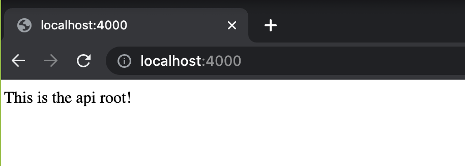
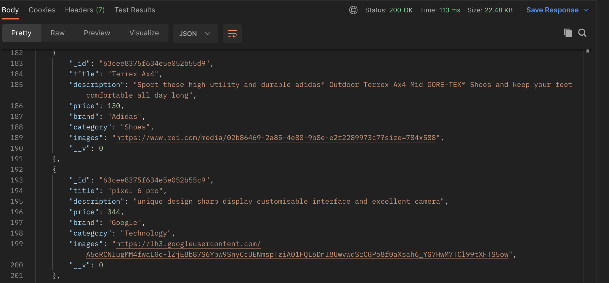

# # Back End API Setup - Shop

## Description

Description TBC

- GitHub Link: https://github.com/muhammadwarrad/BackEnd-Shop
- Railway Link: `TBC`
- API Root Directory: http://localhost:4000/

## API Navigation

Screenshots and API endpoints:

### ***Root API Screenshot***

### ***All Products JSON***

## Endpoints

To get started, navigate to the root path or insert one of the following paths into your browser:
1) Root Path:  http://localhost:4000/
2) All Products:  http://localhost:4000/products/
3) Products by ID: http://localhost:4000/products/:id
4) All Users: http://localhost:4000/users/
5) User: http://localhost:4000/users/:id

## Technical Notes

### Data

We created a model and JSON file that includes product objects that contain the following fields:
- title
- description
- price
- brand
- category
- images

We created a model that includes user objects that contain the following fields:
- username
- password
- email
- cart
- loggedIn

### Dependencies

- cors
- dotenv
- express
- node-fetch
- mongoose

## Future Features

- Admin Access
- Enhance user profile to track logins and purchase history
- Include additional products data

# Team 

## **Anna Druzhinina**
LinkedIn: https://www.linkedin.com/in/anna-druzhinina/

GitHub: https://github.com/annadruzhinina

## **Angela Kwon**
LinkedIn: https://www.linkedin.com/in/angelakwon2/

GitHub: https://github.com/kwonangela

## **Bryant Perez**

LinkedIn: https://www.linkedin.com/in/bryxntperez

GitHub: https://github.com/bryxnt1

## **Muhammad Warrad** 
LinkedIn: https://www.linkedin.com/in/muhammadwarrad/

GitHub: https://github.com/muhammadwarrad

## **Ryan Ehrlich**
LinkedIn: https://www.linkedin.com/in/ryanehrlich/

GitHub: https://github.com/Jagerziel

